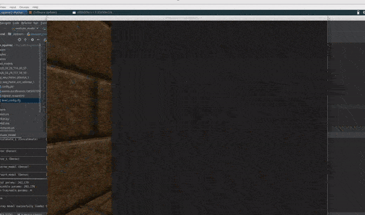

# DoomQN
#####Reinforcement Learning Experiments on the ViZDoom Platform

This work is my personal continuation of a RL hackathon carried out with my colleagues at [nate](https://www.nate.tech/).
As such, some of the code in this repository was written by my excellent teammates [Kefei Hu](https://github.com/CuriousKomodo)
and [Joe Olley](https://github.com/YelloJW).

    

